# Motivation

Robotic manipulators are most useful when they can operate in spaces that were not perfectly modeled at training time. A Franka Panda arm working around shelves, tables, bins, or warehouse fixtures must reach task goals while avoiding both known geometry and newly observed obstacles. Classical motion planners can handle online obstacle updates, but they often pay a latency cost as the scene grows more complex. Learned motion planners, including Motion Planning Diffusion (MPD), can generate high-quality trajectories quickly, but they are usually evaluated in static benchmark environments whose obstacle sets are known before inference.

This project addresses that gap: it turns the repository's offline MPD warehouse planner into an online deployment pipeline that can consume depth observations, reconstruct workspace geometry, inject runtime obstacles into the planning environment, and plan a Panda joint trajectory to an end-effector goal. The application domain is manipulation in semi-structured warehouse/tabletop scenes, where static fixtures are known but additional objects may appear between planning episodes.

The broader robotics relevance is that learned planning methods need perception interfaces before they can be useful outside curated datasets. A planner that only accepts a pre-authored environment cannot react to clutter, sensor updates, or small scene changes. By connecting SAPIEN depth sensing, nvblox reconstruction, obstacle primitive conversion, inverse kinematics, MPD trajectory generation, and simulated execution, this project studies the engineering needed to make a learned planner behave like part of a real robot stack rather than an isolated inference script.

# Problem Statement

The task is to compute and execute a collision-free trajectory for a Franka Panda arm in a warehouse-style manipulation scene with online obstacles. The robot is given its current joint state and a desired end-effector pose. The system must perceive or receive additional obstacle geometry, convert it into a representation usable by the MPD planner, solve for feasible goal joint configurations, and select a valid trajectory.

Inputs:

- Current Panda joint configuration `q_start`.
- Desired end-effector goal pose `ee_pose_goal` as a homogeneous transform or equivalent position/orientation specification.
- Known environment model from `EnvWarehouse`, including fixed warehouse geometry and workspace limits.
- Runtime obstacle information, either as manually specified boxes or as depth-derived geometry from SAPIEN and nvblox.
- Camera specifications for the perception path: two configured 640x480 depth cameras, `overhead_main` and `side_main`, with known intrinsics/extrinsics.

Outputs:

- A selected Panda joint-space trajectory, represented as a time-indexed B-spline/waypoint trajectory over 7 robot joints.
- The selected goal joint state `q_goal`.
- Planning diagnostics: IK attempt summaries, collision metrics, valid trajectory count, inference time, reconstructed box/voxel outputs, and SAPIEN replay statistics.

Assumptions and environment:

- The evaluated robot platform is a fixed-base Franka Panda with gripper enabled in the collision model.
- The scene is the repository's warehouse environment, augmented with runtime obstacles such as boxes at capture/planning time.
- During one planning episode, obstacles are treated as static.
- Camera poses are known in the world/robot frame.
- The perception implementation uses SAPIEN simulated depth, with an interface designed to resemble real depth-camera input. Real Franka execution is a future interface target, while the current implementation verifies execution in SAPIEN.
- Reconstructed geometry is either converted to axis-aligned box primitives or optionally queried through an nvblox ESDF field.
- The planner expects both `q_start`, `q_goal`, and `ee_pose_goal`, so an IK stage is required before MPD inference.

Success criteria:

- The system reconstructs runtime obstacles from depth and exports them as MPD-compatible geometry.
- The start state is verified to be collision-free after obstacle filtering/pruning.
- IK returns at least one joint goal that reaches the desired end-effector pose within the configured SE(3) tolerance and is collision-free.
- MPD returns at least one valid trajectory according to the repository's collision and planning metrics.
- The selected trajectory avoids fixed objects, runtime obstacles, self-collision, and workspace boundary violations.
- SAPIEN replay tracks the planned trajectory with low final and mean joint tracking error.
- Runtime remains practical for online replanning experiments, with planning diagnostics reporting inference time and valid trajectory counts.

# System Architecture

GitHub repository: https://github.com/AndrewLuGit/mpd-splines-public

```mermaid
flowchart LR
    A[Config files<br/>scripts/deployment/cfgs] --> B[Start/Goal Selection<br/>reference sample or user q_start + EE pose]
    B --> C[SAPIEN Scene + Depth Capture<br/>sapien_depth_adapter.py]
    C --> D[Depth Bundle<br/>depth, intrinsics, camera poses]
    D --> E[nvblox Reconstruction<br/>nvblox_bridge.py]
    E --> F[Occupancy / TSDF / ESDF]
    F --> G[Scene Voxelizer<br/>scene_voxelizer.py]
    G --> H[Runtime Boxes<br/>merged cuboids]
    H --> I[Scene Primitives<br/>scene_primitives.py]
    I --> J[EnvWarehouse + obj_extra_list]
    F --> K[Optional NvbloxEsdfField<br/>nvblox_esdf_field.py]
    K --> J
    B --> L[Goal IK<br/>goal_ik.py]
    J --> L
    L --> M[Online MPD Planner<br/>online_planner.py]
    J --> M
    M --> N[GenerativeOptimizationPlanner<br/>pretrained MPD B-spline model]
    N --> O[Best Valid Trajectory + Metrics]
    O --> P[SAPIEN Trajectory Executor<br/>sapien_trajectory_executor.py]
```

The final pipeline is driven by `scripts/deployment/run_online_pipeline.py`. It composes the Phase 2 SAPIEN depth capture script, the Phase 3 nvblox reconstruction bridge, and the Phase 1 online planner into a single perception-to-planning loop.

Perception is implemented in `mpd/deployment/sapien_depth_adapter.py`. It builds a SAPIEN version of `EnvWarehouse`, adds runtime boxes, loads the Panda at the current joint configuration, and captures depth frames from configured cameras. The output is a `DepthCaptureBundle` containing depth images in meters, camera intrinsics, camera poses, and metadata. The implementation supports both render-camera depth and SAPIEN's stereo depth sensor. It can also render a robot-only depth pass to mask the robot out of the observed scene.

State estimation/reconstruction is implemented in `mpd/deployment/nvblox_bridge.py`. It converts SAPIEN camera poses into the optical-frame convention expected by nvblox, integrates depth frames into an nvblox mapper, and extracts occupied geometry using occupancy queries, TSDF queries, or sparse TSDF extraction. The configured final path uses TSDF integration, `tsdf_sparse` extraction, 5 cm voxels, robot subtraction, and filtering of known fixed warehouse geometry.

Geometry conversion is implemented in `mpd/deployment/scene_voxelizer.py` and `mpd/deployment/scene_primitives.py`. Occupied voxel centers are rasterized into a 3D occupancy mask and merged into cuboids using a greedy cuboid strategy. These boxes are then converted into `ObjectField`/`MultiBoxField` objects that can be injected into `EnvWarehouse` through `obj_extra_list`. The code also filters or prunes boxes that would make the robot's current start state collide.

Goal generation is implemented in `mpd/deployment/goal_ik.py`. Since MPD inference requires a joint-space goal as well as an end-effector goal pose, the system samples and optimizes multiple Panda IK candidates. It uses a coarse-to-fine IK strategy, refines candidates with a collision-aware objective, removes colliding solutions, and ranks remaining candidates by collision cost, SE(3) error, and distance from `q_start`.

Planning is implemented in `mpd/deployment/online_planner.py`. `OnlineMPDPlanner` loads the existing inference configuration, resolves the pretrained MPD model, rebuilds the planning task with the runtime `obj_extra_list`, and calls `GenerativeOptimizationPlanner.plan_trajectory(...)` for each selected IK goal candidate until it finds a valid trajectory. The learning component is the pretrained MPD B-spline diffusion planner configured in `scripts/inference/cfgs/config_EnvWarehouse-RobotPanda-config_file_v01_00.yaml`, using the warehouse Panda model, end-effector goal context, 128 time points, 100 trajectory samples, DDIM sampling, and collision/goal/smoothness guidance costs.

Control/execution is implemented in `mpd/deployment/sapien_trajectory_executor.py`. It loads the Panda into a SAPIEN scene, configures joint drives, interpolates between planned trajectory waypoints at the simulator timestep, applies passive-force compensation, and reports tracking metrics such as mean, max, and final joint tracking error. Isaac Gym replay remains available through `online_planner.py`, but SAPIEN is the main deployment executor in the current scripts.

# Design Justification

The system keeps the pretrained MPD planner instead of retraining a new model for every obstacle configuration. This preserves the speed and quality of the learned prior while using MPD's existing environment hooks, especially `obj_extra_list`, to account for online obstacles. The tradeoff is that runtime obstacles must be expressed in a form compatible with the planner's collision model, and extreme scene distributions may still challenge a model trained on the original warehouse data.

The perception stack uses SAPIEN depth before real RealSense hardware. This gives exact control over camera poses, obstacle placement, and robot state, making failures easier to debug. The tradeoff is realism: simulated depth is cleaner and more controlled than real sensor data. To reduce this gap, the implementation supports stereo-depth capture and robot-depth masking, which are closer to the real deployment problem than manually injecting boxes.

nvblox was chosen as the reconstruction layer because it is a robotics-oriented volumetric mapping system that can integrate depth frames into TSDF, occupancy, and ESDF representations. This is more realistic than directly passing ground-truth boxes from simulation. The cost is dependency complexity, CUDA requirements, and extra representation-conversion work.

The final planning path converts reconstructed voxels into merged axis-aligned boxes. Boxes are a conservative and simple interface to the existing MPD collision system, and they are easy to serialize, visualize, filter, and inject into `EnvWarehouse`. The tradeoff is geometric fidelity: cuboids can over-approximate objects and may remove free space. The code also includes an optional `NvbloxEsdfField` path, which can represent geometry more directly, but box conversion is easier to debug and more robust against integration and gradient-query issues.

The planner uses a separate IK stage instead of asking MPD to solve directly from end-effector pose alone. This was necessary because the repository's inference stack expects `q_start`, `q_goal`, and `ee_pose_goal`. Sampling multiple IK candidates improves robustness to redundancy and obstacle placement. The tradeoff is extra latency, but it prevents the planner from being bottlenecked by a single poor or colliding goal configuration.

The system explicitly filters reconstructed boxes that collide with the current robot state. This is important because depth reconstruction often sees the robot or produces voxels close to robot links, and a start state in collision causes planning to fail immediately. The tradeoff is that filtering may remove real nearby obstacles if the perception mask is imperfect, so it should be treated as a guarded engineering fix rather than a substitute for calibrated robot segmentation.

SAPIEN trajectory replay was chosen as the final execution target instead of immediately commanding a real Franka. It verifies that the trajectory can be tracked by a simulated articulated robot with joint drives and physics, while avoiding the safety burden of hardware execution. The tradeoff is that controller-rate constraints, hardware latency, and real collision safety remain future work.

# Design Evolution

At the proposal stage, the project goal was a real-world MPD deployment stack for a Franka Panda arm: capture depth from simulated or real cameras, reconstruct the scene, convert geometry into obstacles, plan with MPD, and eventually execute on hardware. The initial idea treated perception and execution as direct extensions around the existing planner.

By the midterm implementation plan, the design became more concrete and phased. The main insight was that the existing MPD inference path was not simply an end-effector planner: it still required `q_pos_start`, `q_pos_goal`, and `ee_pose_goal`. That turned online IK from a nice-to-have into a core module. The plan also identified `EnvWarehouse(..., obj_extra_list=...)` as the cleanest integration point for runtime obstacles, so Phase 1 became direct runtime box injection before any depth reconstruction.

The next design step was to separate the system into independently testable phases. Phase 1 handled online planning with hand-authored boxes. Phase 2 added SAPIEN scene and depth capture. Phase 3 added nvblox reconstruction. Phase 4 combined these pieces into a single online pipeline. Phase 5, real Franka execution, remained the target but was deferred because perception/planning integration and safety checks had to work first.

In the final implementation, the scope shifted from physical deployment to a complete simulated deployment pipeline. The final system captures SAPIEN depth from two cameras, integrates frames with nvblox, filters known fixed scene geometry and robot geometry, converts occupied voxels into merged boxes, injects those boxes into MPD, solves collision-aware IK, plans with the pretrained MPD B-spline model, and replays the selected trajectory in SAPIEN. This was a practical pivot: it preserved the real deployment architecture while making the project testable in the available environment.

Several details changed because of empirical failure modes. First, direct boxes were retained as a fallback because they isolate planner behavior from perception errors. Second, robot masking and robot-sphere subtraction were added because reconstructed depth could include the robot itself, making `q_start` falsely collide. Third, start-state box pruning was added because even after masking, small reconstructed boxes near the arm could make the planner reject otherwise reasonable scenes. Fourth, the voxel-to-box conversion evolved from connected-component boxes toward greedy cuboids, which keeps the primitive count manageable while representing clutter more flexibly than one large bounding box per component.

The final architecture is therefore more modular than the initial idea. Instead of one monolithic "online planner," it has explicit perception, reconstruction, geometry conversion, IK, planning, and execution boundaries. That modularity made pivots easier: the system can run with manual boxes, nvblox-derived boxes, or an optional ESDF field, and it can evaluate planning even when the real robot interface is not yet available.
